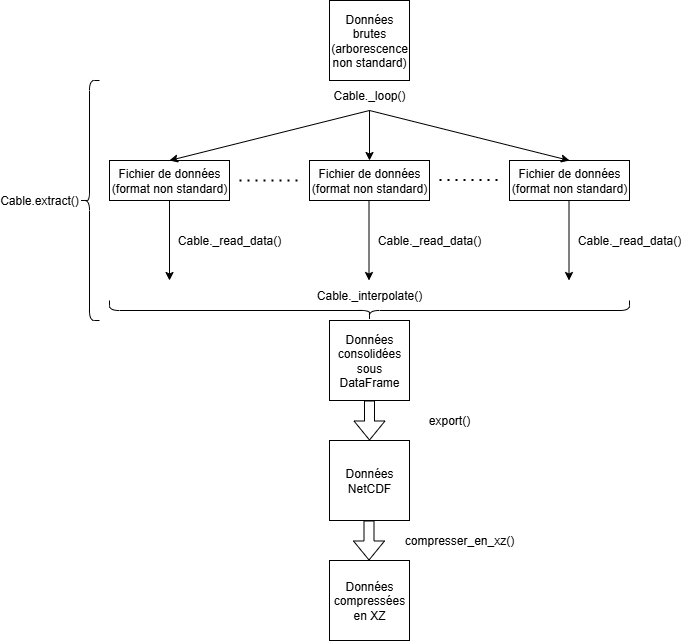

# Application _Cervère_

Code source : https://github.com/tinmar112/rte-cervere

## Introduction

### Aperçu

Cette application __Python__ a pour but de 
consolider les données DTS (_distributed 
temperature sensor_) provenant de différents 
câbles LS/LSM de RTE.
  
Pour chacun des câbles, l'application permet
d'extraire les données brutes, initialement 
contenues dans des dossiers d'export dont le
format (non standard) est propre au système 
DTS intégré au câble.
  
Elle procède ensuite à la consolidation des
données sous un format unique, puis à une 
interpolation qui convertit les mesures en
échantillons horaires.
  
Enfin, les données heure par heure (converties
en UTC) sont chargées dans des fichiers
NetCDF, compressés sous format XZ. 

### Cas d'usage

Le stockage standardisé issu de ce programme 
permet une visualisation des mesures DTS de 
chaque câble en 3 dimensions (temps, point 
kilométrique, température).

### Logique du programme

L'application est lancée par lecture du
fichier ```main.py```. Le fil d'exécution est
le suivant :
- La fonction ```
functions.update(nom_cable,
date_debut, date_fin)``` est 
appelée.
  - L'extracteur (classe ```cables.Cable```) 
 est instancié pour le câble ```nom_cable```
 entre ```date_debut``` et ```date_fin```.
    - La méthode publique 
    ```cables.Cable.extract()``` parcourt le
    dossier associé à ```nom_cable```,
    sélectionne les données idoines
    et les consolide sous une DataFrame ```df```
    avec les colonnes ```['time','KP','temperature']```.
  - La fonction ```functions.exporter(df, path_save)```
  récupère ```df``` et la transforme
  en tableau NetCDF divisé par mois 
  dans le dossier ```path_save```.
  -  La fonction ```functions.compresser_en_xz()```
  compresse ces données en NetCDF sous format
  XZ dans le répertoire ```path_save```.



Tout au long de l'exécution, le ```logger```
enregistre les étapes de l'extraction et les
indique dans la console.

## Tutoriel

### Stockage des données brutes

Le stockage des données brutes est primordial.
__Il convient de respecter l'arborescence déjà 
présente dans le dossier des données brutes.__
  
__À minima, les données brutes doivent être 
rangées par câble et par année, chaque 
sous-dossier ayant pour nom son année.__ 

_Exemples :_
- Arborescence correcte (ici pour Fécamp L1):  
H.FALL61SAINN  
├── 2023  
├── 2024  
└── 2025
- Ne pas mettre de dossier "2025_S1", mais 
seulement "2025" (qui sera complété plus tard 
par les données du S2).

#### Intégrité des données

Lors de l'import des données brutes, __s'assurer
que les fichiers (.csv ou .txt) semblent de
bonne qualité__ : vérifier qu'ils ont tous la même
structure de nom, qu'ils ont tous à peu près la
même taille, qu'ils parcourent toute la
période, etc.

### Dépendences

L'exécution de l'application nécessite les 
librairies (PyPI) suivantes (au sein d'un
environnement virtuel muni de ```pip```, 
faire ```% pip install``` sur chacune d'entre 
elles).
- ```colorlog```
- ```netCDF4```
- ```numpy```
- ```pandas```
- ```pytz```
- ```tqdm```
- ```xarray```

### Lignes de commande

__La mise à jour s'effectue toujours jusqu'au dernier
jour du mois précédent la date courante.__
  
Pour lancer la mise à jour, aller dans le répertoire
de l'application, dossier ```/new```.
(On veillera à se placer dans un
environnement contenant les librairies ci-dessus.)
  
Lancer la ligne de commande : 
  
```% python main.py [LIT_CABLE] -r [RAW] -s [SAVE]``` 
  
où 
- ```[LIT_CABLE]``` (obligatoire)
est à remplacer par le code LIT du câble qui doit
être mis à jour ;
- ```[RAW]``` (optionnel)
est à remplacer par le chemin du dossier contenant
toutes les données brutes (chemin par défaut dans le code) ;
- ```[SAVE]``` (optionnel)
est à remplacer par le chemin du dossier contenant
toutes les données traitées (chemin par défaut dans le code).

On peut rajouter ```--verbose``` pour passer en mode
bavard. Le détail des options est disponible en
faisant ```% python main.py --help```.

_Un exemple illustratif :_

Si l'on veut démarrer la mise à jour du câble
Boutre-Trans (code BOUTRL61TRANS) en suivant 
les chemins par défaut, on lancera :  

```% python main.py BOUTRL61TRANS -r //nashdprdif274/SMB_DTS-DAS/DTS/RAW -s //nashdprdif274/SMB_DTS-DAS/DTS```
  
ou plus simplement :
```% python main.py BOUTRL61TRANS```

[!IMPORTANT] Lorsqu'un nouveau câble est ajouté, son
dossier ```[SAVE]``` est vide. On peut alors gagner du 
temps sur l'initialisation de la mise à jour 
en configurant manuellement
le mois de départ de l'extraction dans la fonction
```functions.latest.latest()```.  
Par exemple, il peut
être utile de régler la variable locale
```latest_mo = pd.Timestamp(year=2025, month=6, day=1, tz=tz)```
pour un parc éolien
mis en service en juin 2025. Autrement, le programme
cherchera à parcourir des mois sans donnée : ça marche,
mais ce sera plus long.

### Entretien de l'application

En temps normal, un changement dans le format
d'écriture des données ou l'ajout d'un nouveau
câble nécessite d'__adapter la classe existante__ 
ou de __créer une nouvelle classe__
héritée de ```Cable```.
  
Méthode à suivre :
- Définir la nouvelle classe, déclarer le fuseau
horaire avec ```self._tz = pytz.timezone('fuseau')```
  (pour un nouveau câble) ;
- Implémenter la méthode héritée ```Cable._read_data(chemin)```.
Celle-ci prend en argument un fichier à lire et le transforme
en DataFrame (colonnes ```['time','KP','temprature]``` -
 ```time``` est souvent une valeur unique dans un même fichier)
et la rajoute à la liste ```self._data```.  
__Respecter impérativement les types pour chaque colonne :__
  - ```time```:```datetime64[ns, UTC]``` (ou un autre fuseau,
  tel que ```datetime64[ns, CET]```)
  - ```KP```: ```float32```
  - ```temperature```:```float32```
  
Si le rangement des données n'est pas consistant, il
faut en plus modifier la méthode ```Cable._loop()```.
  
[!WARNING]  
La première donnée de chaque mois (00:00:00 UTC le 1er du mois) est manquante en raison
du paramètre ```limit_area='inside'``` de la méthode ```df.interpolate()``` dans ```Cable._interpolate()```.

Cette option à été réglée ainsi pour éviter une extrapolation des valeurs disponibles à l'ensemble
d'un intervalle (par ex. lorsque les mesures présentent un trou dans le temps).  
__Alternative__ : Compléter/remplacer cette option par ```limit = 3 ou 4```. 
(Mais alors des NaN risquent de subsiter en cas d'interruptions
courtes, et des dates correspondantes d'être supprimées par le dropna...)


Se référer à la doc pandas : https://pandas.pydata.org/docs/reference/api/pandas.DataFrame.interpolate.html
